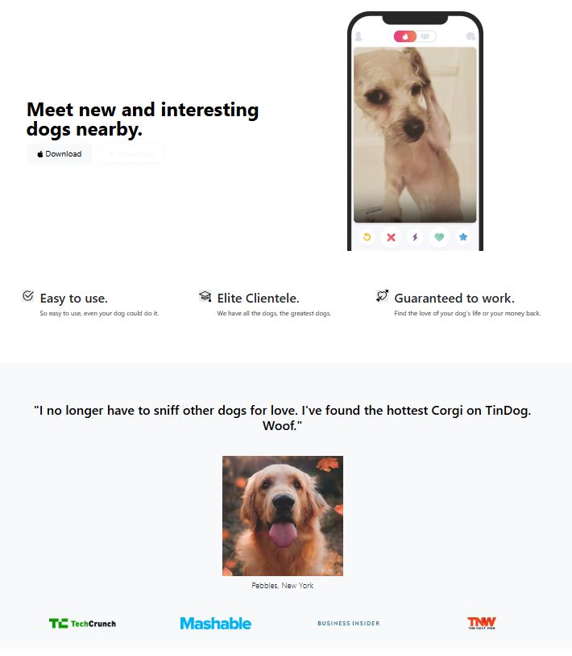
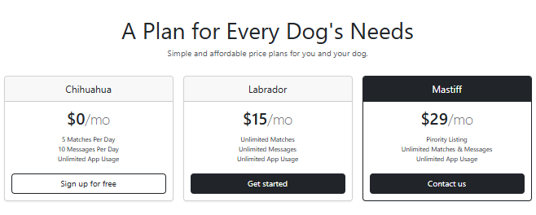

# TinDog Project

A simple responsive website built with **HTML** and **CSS** that helps dogs find love!  

## Features
- Responsive design using HTML and CSS
-  Pricing section with structured cards for different plans  
- Works on desktop and mobile devices

## Technologies Used
- HTML5
- CSS3
- Responsive design principles

## Live Demo
Check out the live website [here](https://rukendemirel.github.io/TinDog-Project/)

## Screenshots

